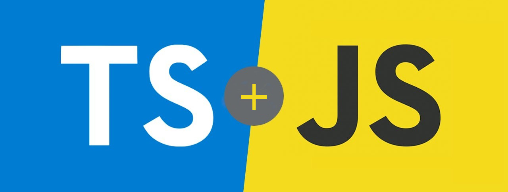

 
	

	
	

  <a href="#projeto">Projeto</a>&nbsp;&nbsp;&nbsp;|&nbsp;&nbsp;&nbsp;
  <a href="#tecnologias">Tecnologias</a>&nbsp;&nbsp;&nbsp;|&nbsp;&nbsp;&nbsp;
  <a href="#bookmark_tabs-licencia">Licença</a>

## Projeto

O objetivo desse repositório é publicar meus estudos em Javascript e Typescript.

## Tecnologias

- [Typescript](https://www.typescriptlang.org/)
- [Javascript](https://www.javascript.com)

## :bookmark_tabs: Licencia

Esse projeto está sob a licença MIT. Veja o arquivo [LICENSE](LICENSE) para mais detalhes.
